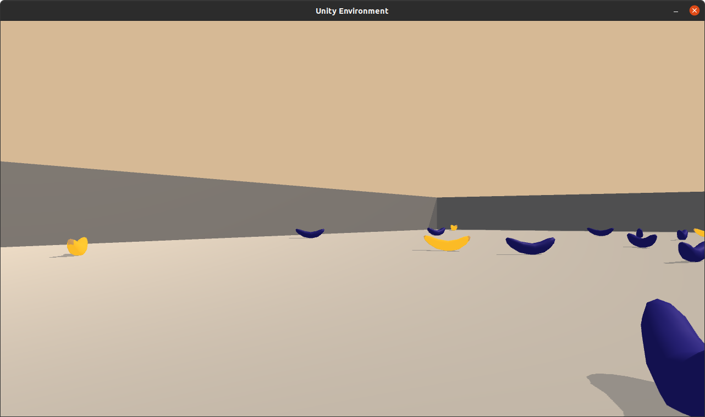

# Project: Navigation

## Introduction

This project is about training a reinforcement learning get that navigates in a square world and collects bananas.
The given environment is modeled with Unity ML Agents. 
The agent is similar to a Deep-Q Network as described in "Human level control through deep reinforcement learning".

## Problem Description

The task consists in training an agent that navigates in a 2D world populated with bananas.
The goal of the agent is to collect as many yellow bananas as possible, and to avoid blue
bananas.

The environment has two modes, one providing an image of the scene (pixels), and another 
providing ray-based perceptions of objects in front of the agent. In this project, only the 
second environment mode iis used.

The state space has 37 dimensions (floating point numbers) and contains the agent's velocity, 
along with ray-based perception of objects around the agent's forward direction.

Given this information, the agent has to learn how to best select actions. 
Four discrete actions are available, corresponding to:

* 0 - move forward.
* 1 - move backward.
* 2 - turn left.
* 3 - turn right.

A reward of +1 is provided for collecting a yellow banana, and a reward of -1 is provided 
for collecting a blue banana. 

The task is episodic, and in order to solve the environment, the agent must get an average 
score of +13 over 100 consecutive episodes.

## Getting Started

1. Clone or download the DRLND Repository: https://github.com/udacity/deep-reinforcement-learning 
2. Please follow the instructions in the DRLND GitHub repository to set up your Python environment. 
   These instructions can be found in the [README](https://github.com/udacity/deep-reinforcement-learning/README.md) at the root of the repository. By following these 
   instructions, you will install dependencies like PyTorch and a few more Python packages.
3. Download a prepared Unity environment for your operating system: 
   - [Linux](https://s3-us-west-1.amazonaws.com/udacity-drlnd/P1/Banana/Banana_Linux.zip)
   - [Linux headless](https://s3-us-west-1.amazonaws.com/udacity-drlnd/P1/Banana/Banana_Linux_NoVis.zip)
   - [Windows](https://s3-us-west-1.amazonaws.com/udacity-drlnd/P1/Banana/Banana_Windows_x86_64.zip)
   - [MacOS](https://s3-us-west-1.amazonaws.com/udacity-drlnd/P1/Banana/Banana.app.zip)

   Then, place the file in the `p1_navigation/` folder in the DRLND GitHub repository, and unzip (or 
   decompress) the file.
4. Download the files from this repository and place them into the `p1_navigation/` folder.

There are five main files in this repository:

1. `navigation.py` is the main file. It contains hyperparameters, the classes 
   for the neural network, the agent and the DQN learning function.
2. `train.py` is a simple script for training an agent from the command line.
3. Alternatively, `Navigation.ipynb` can be used to train an agent, and to make 
   a plot of average scores. 
4. `play.py` takes a trained agent and plays an episode, including visualisation.
5. `checkpoint_1.pth` are the weights of the trained agent

## Instructions

The code was developed on Linux. If you are running Windows or MacOS, please change 
the path name of the Unity environment accordingly. 

### Training a new agent

* Change hyperparameters in `navigation.py`
* Run the `train.py` script. Alternatively, use the `Navigation.ipynb` jupyter notebook.

### Running a simulation

* Run the `play.py` script. By default, this plays one episode with a random agent. 
  If you specify the learned weights via the `--w` option: `python play.py --w checkpoint_1.pth` 

