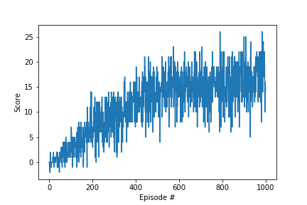

# Report: Navigation

by Oliver Koch

## Learning Algorithm

The learning algorithm is a simplified version of the one that Google DeepMind 
used to train agents on Atari games, as described in the 
[DQN paper](https://storage.googleapis.com/deepmind-media/dqn/DQNNaturePaper.pdf).

The agent learns a policy, that is, which is the action the maximized the score 
in the long run given the current state (observations).

The algorithm is variant of Temporal Difference Learning, in particular Q-Learning, 
where the state-value function is updated during the episode, and the agent attempts 
to approximate the optimal function value at every time step.

During learning, the agent follows an epsilon-greedy policy. That is, the agent does 
not strictly choose the best action (exploit what he has learned so far), but picks 
a random action with a certain probability proportional to epsilon (to further 
explore the environment). 
Epsilon is high at the beginning (exploration), and decreases over time (shift 
towards exploitation).

The state space of the environment is continuous, and a nonlinear function 
approximation is used to represent the state value function. 

The algorithm contains two improvements. The first is called experience replay. 
With experience replay, the algorithm does not update the parameters after each 
time step. Instead, it continuously stores experiences (tuples of state, action, 
reward) in a large experience buffer. After a defined number of time steps, a 
batch of experiences is randomly sampled from the buffer, and the network weights
are updated based on these experoences.

The second improvement is called fixed targets, meaning that the algorithm keeps
track of two sets of weights. One set (local weights) is used to select the 
nect action, the other set (target weights) is used as a target when updating 
the local weights. This reduces the learing of the weights to a supervised ML 
problem.
The new target is then set as a linear interpolation of new 
local and old target weights.

#### Chosen hyperparameters

| Parameter | Value | Remark |
| --- | --- | --- |
| Minibatch size | 64 | number of training cases over which weight update is carried out. |
| Replay memory size | 100000 | number of most recent experiences. Minibatch is sampled from this buffer. |
| target network update frequency | 4 | weights are updated every 4th time step |
| tau | 0.001 | Soft update of target weights $\theta_{target} = \theta_{target} + \tau \theta_{local}$
| discount factor | 0.99 | Discount factor gamma used in Q learning update |
| optimizer | Adam | using default parameters for $\beta$ and $\beta^2$ |
| learning rate | 0.00025 | The learning rate used by the optimizer. Same value as in DQN paper. |
| initial exploration | 1.0 | initial value of $\epsilon$ in epsilon-greedy policy | 
| final exploration | 0.01 | final value of $\epsilon$ in epsilon-greedy policy |
| exploration decay rate | 0.995 | $\epsilon$ is decreased by this factor every episode |

Most of the hyperparameters are idential to the ones used in a previous mini.project.
I varied some of the hyperparameters. Some variations had no effect, others decreased the 
performance. Experients carried out:

* learning rate: 0.0025, 0.005, 0.01
* tau: 0.01, 0.001
* epsilon_final: 0.1, 0.001
* epsilon_decay: 0.995, 0.997, 0.999

#### Neural network architecture

The neural network has three layers, two hidden layers and one output layer.
Both hidden layers have a width of 64 neurons. 
ReLu is used as activation function 

    ReLu(FC(37, 64)) -> ReLu(FC(64, 64)) -> FC(64, 4)

I tried various modifications to the network architecture, which did not 
improve the result:

- making hidden layers wider (128, 256 neurons)
- making the network deeper by adding a third hidden layer
- using SeLu instead of ReLu as a nonlinear activation function

## Plot of Rewards

After 496 episodes, an average score (over 100 episodes) of 13 was achieved. 
Training continued until 1000 episodes were completed. 
The final average score is 16.80.

There are two YouTube videos, one of the [trained agent](https://youtu.be/w-poO3H8ICg), 
one of a [random agent](https://youtu.be/MQixDCK0A18).
The difference in performance is obvious.

## Ideas for future work

- double dqn, dueling dqn, proritized experience replay
- sequence of states

- give him a sequence of actions, as in the dqn paper